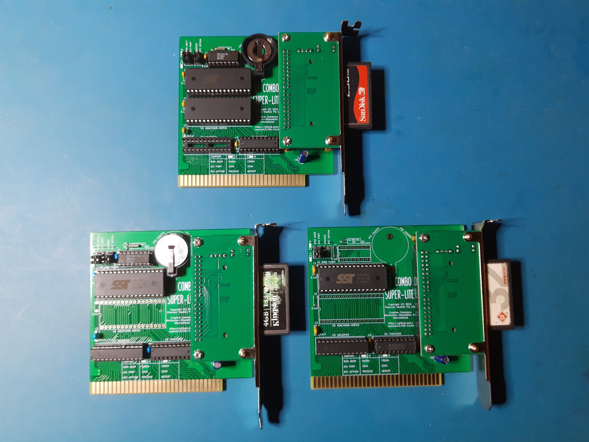

ISA-Cards
=========

ISA card designs for use in Vintage PCs.

ISA Template
============

**Status:** Fit tested and appears correct.

**Description:** A template from which to build ISA cards. The board dimensions
around the edge connector are from an early IBM PC Technical
Reference Manual (5150 or 5160). The rear bracket positioning
has been measured from an original IBM floppy controller taken
from an IBM 5150. This board was an excellent fit when test-fitted
in an early Tandy 1000 (25-1000).

The mounting for the CF adapter has also been comfirmed in the
same Tandy 1000. It too was a excellent fit. 

There may be some variation in fit due to various tolerances. 
The fit does not seem to be particularly important - a wide variation
in fit has been found across various commercial ISA cards.

Tandy PLUS Template
===================

**Status:** Untested.

**Description:** A template from which to design cards and/or back plates
for the Tandy 1000 EX/HX computers. Includes approximate board outlines
as measured from Tandy's memory/DMA board, Tandy's serial board and
Rob Krinecki's 3 in 1 board. Includes various notes about safe areas,
potential places to extend the board dimensions, etc.

CF-Combo-Super-Lite 1, 2
===================

**Status:** Design built and tested in all configurations. No issues found.

**Description:** An 8 bit ISA card with fully-contained compact flash card and
XT-IDE BIOS. This simplified design uses only 3 ICs for the CF/BIOS functionality.
It makes use of a commonly availalbe, inexpensive compact flash adapter with
integrated mounting bracket.

The board optionally supports the following features:

* An integrated DS1216-E compatible SmartWatch. See 
  https://github.com/JayesonLS/SmartWatchRedux for more information
   about the Dallas SmartWatch.
* 512K of SRAM for the Tandy 1000, 1000A or 1000 HD models only
  (25-1000, 25-1000A, 25-1001). This will bring a stock Tandy
  1000 to 640K. Remove any other memory upgradebefore installing.
  *Do not use the 512K RAM option in any other model of Tandy 1000
  or PC. The memory mapping is only correct for the supported Tandy
  1000 models and will result in memory conflicts in any other system.*

BasicSerial
===========

**Status:** Built and fully tested. The Rear bracket is located too
high and needs to be corrected. No other issues found.

**Description:** Adds a single 9 pin serial port to a vintage PC. Created with early
Tandy 1000's in mind which have no COM ports from the factory.

Decoding is handled by a 74xx688. Alternatively, a JED file is provided
for programming the needed decode functionality into a GAL16V8/ATF16V8.

**Configuration:** Before installing, configure the port selection jumpers
to a COM port not yet present in the system. Details are located on the
board by the port jumpers. Configure the IRQ jumper to an approriate
selection. For no IRQ, remove the IRQ jumper. Suggested IRQ settings are
located on the board by the IRQ jumper.

DualSerial 1
==========

**Status:** Untested. Vertical positions of serial connectors are only
approximate (waiting on a bracket to arrive for reference).

**Description:** Adds *two* 9 pin serial ports to a vintage PC. Created with early
Tandy 1000's in mind which have no COM ports from the factory.

**Configuration:** Before installing, configure the port selection jumpers
to COM ports not yet present in the system. Details are located on the
board by the port jumpers. Configure the IRQ jumpers to an approriate
selection. For no IRQ, remove the IRQ jumper. Suggested IRQ settings are
located on the board by the IRQ jumpers.

EX-HX Combo 1, 2
===========

**Status:** Still in design.

**Description:** Multiple upgrades for the Tandy 1000 EX/HX
in a single board. It adds the following:
* Up to 384K of additional base memory to bring the EX/HX up
  to 640K
* Up to 160K of upper memory (UMB)
* Rear accessable CF card slot
* XT-IDE BIOS
* Serial port with 16550 UART 
* DS1316 SmartWatch real time clock

Functionality is very similar to Rob Krinecki's 3 in 1/4 in 1 boards,
with the following differences:
* Can be fitted in either the lower or middle board position on the
  EX/HX.
* Can be used together with Tandy's original DMA/memory board. This
  configuration adds DMA functionality and makes the top board 
  position available for a third upgrade board.
* Support for additional upper memory on the Tandy 1000 EX. The EX
  allows for more upper memory than the HX due to the EX having a
  smaller system ROM than the HX. 
* Base and upper memory configuration, COM port selection, COM IRQ,
  ATA (IDE) port address, etc. are configurable via dip switches.
  Using the default settings, the board is equivalent to the proven
  configuration of Rob Krineki's 3 in 1 board.

Riser
=====

**Status:** Tested and works well. 

**Description:** Raises an 8 bit ISA card up out of a desktop case. Makes it easier
to probe ISA cards during development/testing. Can optionally fuse
the ISA power rails. Low-ohm resistors can be fitted to the power 
rails to assist with current measurement. ISA pins are marked for 
easy identification.

Not intended for permanent installation. 

The bracket is from a Compact Flash to IDE adapter intended for
installation into PCI slots. It must be raised off the board using
standoffs totalling 14.6mm high.

ISAtoTandyPlus
==============

**Status:** Untested.

**Description:** Allows connection of a Tandy 1000 EX/HX Plus board in a standard
ISA slot. Intended for use on an ISA riser board for 
development/testing. 

Not intended for permanent installation.

---------------
**1** Construction requires programming of one or
    more GAL16V8/ATF16V8 and/or GAL22V10/ATF22V10 simple programmable
    logic devices. JED file provided. A TL866 or similar programmer
    can program most of these devices.
    
**2** Construction requires programming of the required
    BIOS image into the flash ROM. Most common programmers, such as
    the TL866, can be used for this.

